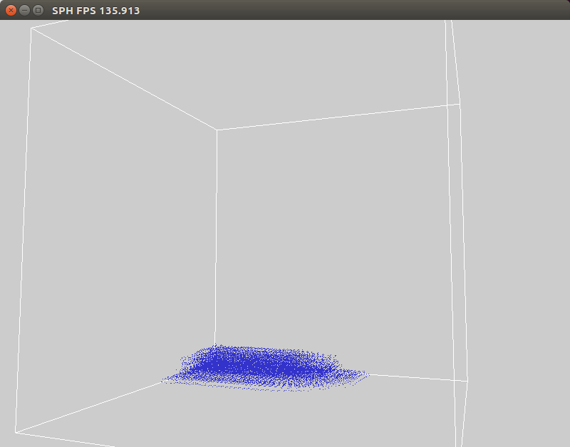

# Implementation of Smoothed particle Hydrodynamics with CUDA

A 3D implementation of [SPH][1] using CUDA. Currently simulates 16384 particles.

 
 
 

[1]:http://matthias-mueller-fischer.ch/publications/sca03.pdf
